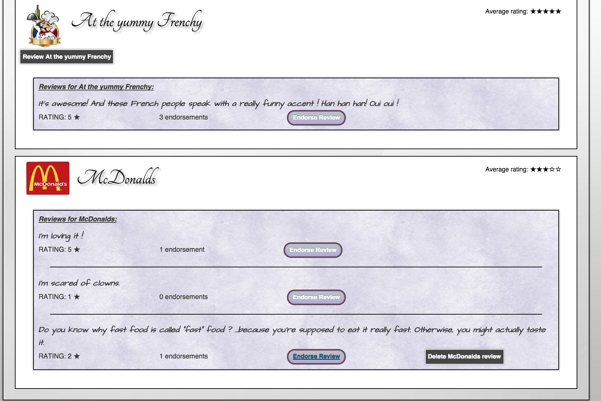
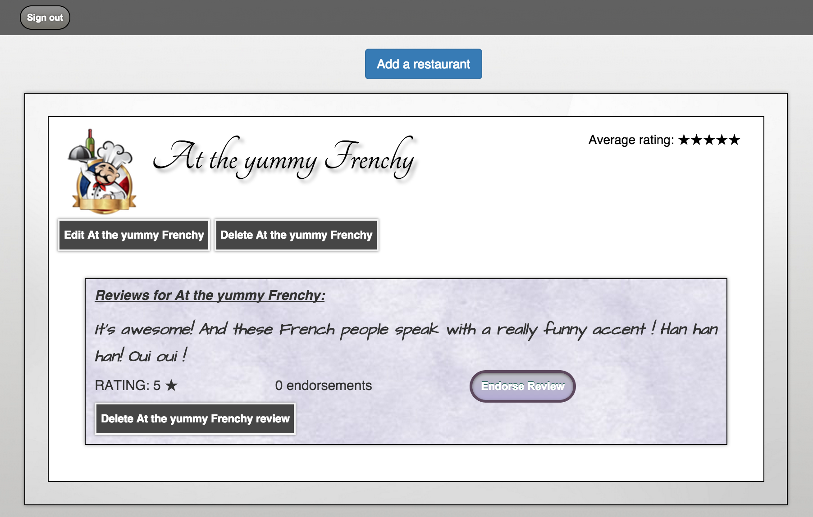
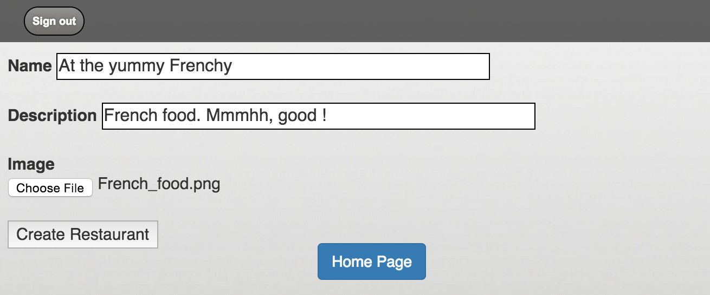
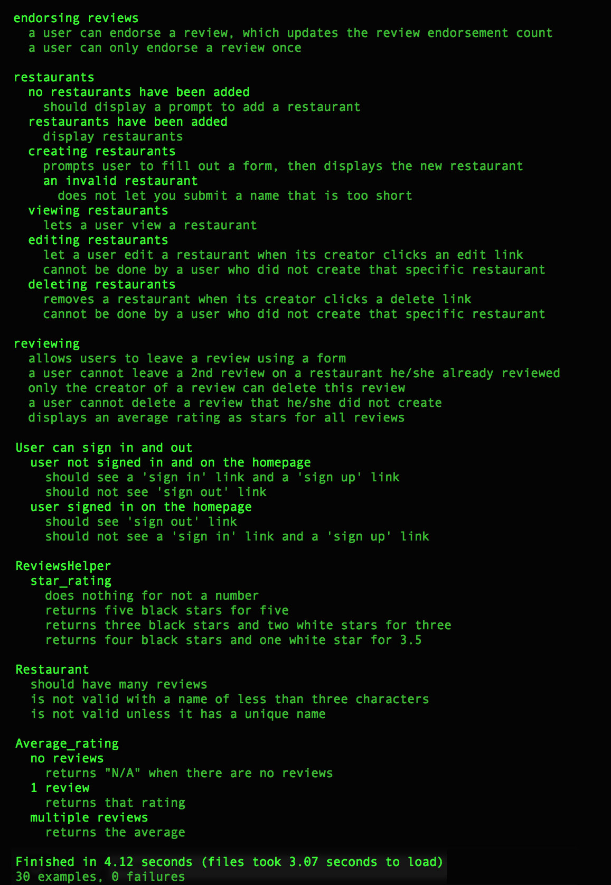

[](https://travis-ci.org/GBouffard/yelp_clone) [](https://coveralls.io/github/GBouffard/yelp_clone?branch=master) [](https://codeclimate.com/github/GBouffard/yelp_clone)

:fork_and_knife: Yelp-Clone :fork_and_knife:
===
This is the week 8 tutorial from Makers Academy: the idea was to create a YELP clone to get a basic introduction to Ruby On Rails.







Objectives of exercise
----
Object orientation, folder structure, migrating the Databases correctly, test-driving everything.

Technologies used
----
- Ruby
- Ruby on Rails
- Capybara
- Rspec
- HTML, CSS & Bootstrap
- Postgresql
- Javascript & AJAX
- Additional Gems: Omniauth-Facebook, Paperclip and Poltergeist

How to run it
----
```
git clone git@github.com:GBouffard/yelp_clone.git
cd yelp_clone
bin/rails server
```
go to localhost:3000, and you can now create restaurants, wit their names, description and pictures and add, update and delete reviews and endorsements.

How to test it
----
```
cd yelp_clone
rspec
```

And this is what you should see
